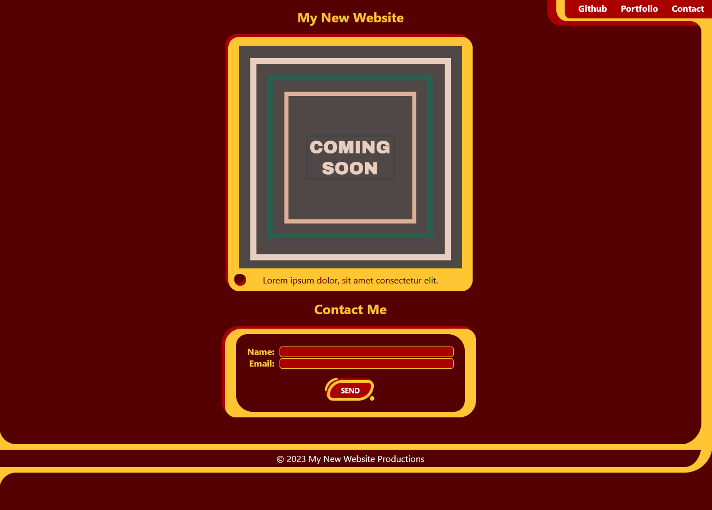

# Project 01 - Personal Landing Page

## Description
This is a submission for the first of several mini-projects for the University of Sydney Coding Bootcamp.

In this exercise we were tasked with building a landing page using a combination of HTML and CSS, with an emphasis on keeping the page accessible.

Skills learned in the process of developing this page included:
- HTML structure, including the use of semantic HTML elements
- HTML attributes, including those used to improve ease of access for users who require screen readers or other assistive technologies
- Basic CSS selectors and properties
- Display modes, positioning, and the Box Model

Additionally, the project features a lot of CSS tricks involving the ::before and ::after pseudo-selectors to create inner radii for various elements, testing out how they interact and finding comfortable sizing for most situations.

## Usage
You can access the project's GitHub Page here: https://natpoulson.github.io/project-01-landing-page/

The site can be browsed in its entirety without any special requirements. There are a couple of things to note however:
- Currently the contact me form does nothing, and is purely for display purposes.
- The portfolio link doesn't go anywhere, but it will show a little tooltip that there's content coming soon.

## Preview

## Credits
The following resources were extremely helpful in honing understanding of the following topics:
- CSS Positioning: Kevin Powell (Director). (2023, November 15). CSS position deep dive. https://www.youtube.com/watch?v=fF_NVrd1s14
- Creating inner-radii using pseudo-elements: Kavinda, S. (2020, April 7). How to create fancy corners with CSS. LogRocket Blog. https://blog.logrocket.com/how-to-create-fancy-corners-in-css/
- README Template: Professional README Guide from The Full-Stack Blog, an internal resource provided by edX Boot Camps LLC. A link has not been included as it was provided as proprietary material.

## License
This project is available under the MIT license. Please refer to the [license file](./LICENSE) for complete license details.